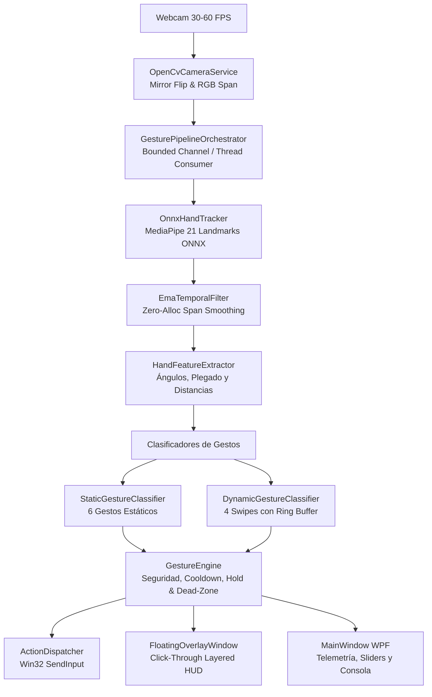

# MVPGesture Studio — Control Gestual en Tiempo Real (.NET 10)

Sistema de reconocimiento y control gestual por visión artificial de alta precisión, baja latencia y cero asignaciones de memoria en heap durante el bucle de procesamiento. Permite controlar el ratón global, disparar hotkeys del sistema operativo y automatizar flujos de trabajo en Windows (como navegación web o modelado 3D en Blender) mediante una cámara web estándar y modelos ONNX de MediaPipe.

---

## 1. Arquitectura del Proyecto

El sistema está diseñado bajo una arquitectura modular y desacoplada en .NET 10 compuesta por 8 proyectos:



### Proyectos de la Solución (`MVPGesture.slnx`)

| Proyecto | Rol y Responsabilidad |
|---|---|
| **`GestureControl.Core`** | Entidades de dominio (`HandPose`, `HandLandmark`, `AppProfile`), interfaces del pipeline y el orquestador multihilo (`GesturePipelineOrchestrator`). |
| **`GestureControl.Vision`** | Captura de cámara con OpenCV (`OpenCvSharp4`), modo espejo horizontal y motor de inferencia ONNX (`Microsoft.ML.OnnxRuntime`) para 21 landmarks de mano. |
| **`GestureControl.Gestures`** | Filtro temporal EMA (`Span<T>`), extracción de características geométricas, clasificación estática, clasificador dinámico de trayectoria con búfer circular y motor de estados (`GestureEngine`). |
| **`GestureControl.Actions`** | Mapeo y ejecución de acciones del sistema operativo y gestor de perfiles de aplicación (`ProfileManager`). |
| **`GestureControl.Interop`** | P/Invoke nativo de Win32 (`SendInput`, `SetCursorPos`, estilos de ventana transparentes) y detector de elevación de privilegios UIPI (`UipiChecker`). |
| **`GestureControl.Infrastructure`** | Persistencia asíncrona de perfiles de configuración en formato JSON (`ProfileStorageService`). |
| **`GestureControl.App`** | Interfaz gráfica principal en WPF con calibración en vivo, consola de telemetría y HUD flotante transparente click-through. |
| **`GestureControl.Tests`** | Batería de 40 pruebas unitarias con xUnit (`dotnet test`). |

---

## 2. Catálogo de Gestos Reconocidos

El motor reconoce **10 gestos estables** (6 estáticos y 4 dinámicos):

| # | Gesto | Tipo | Condición Geométrica / Cinemática | Acción Global por Defecto | Acción Perfil Blender |
|:---:|---|:---:|---|---|---|
| 1 | **`OpenHand`** | Estático | 5 dedos extendidos sostenido >= 1.0s | **Armar / Pausar Sistema** | Soltar Clic Medio |
| 2 | **`Fist`** | Estático | 5 dedos plegados hacia la palma | Clic Central (MMB) | Órbita 3D (MMB Presionado) |
| 3 | **`Pinch`** | Estático | Distancia pulgar-índice <= 0.065 | Clic Izquierdo (LMB / Drag) | Clic Izquierdo (LMB) |
| 4 | **`IndexPoint`** | Estático | Solo índice extendido (resto doblados) | **Control de Cursor (Ratón)** | Mover Cursor |
| 5 | **`TwoFingersPeace`** | Estático | Índice y medio extendidos en 'V' | Clic Derecho (RMB) | Centrar Vista (NumPad .) |
| 6 | **`LateralPalm`** | Estático | Mano de perfil perpendicular a cámara | Modo Neutro (Descanso) | Modo Neutro |
| 7 | **`SwipeLeft`** | Dinámico | Desplazamiento horizontal rápido a la izquierda | Deshacer (`Ctrl + Z`) | Deshacer (`Ctrl + Z`) |
| 8 | **`SwipeRight`** | Dinámico | Desplazamiento horizontal rápido a la derecha | Rehacer (`Ctrl + Y`) | Rehacer (`Ctrl + Shift + Z`)|
| 9 | **`SwipeUp`** | Dinámico | Desplazamiento vertical rápido hacia arriba | Subir Volumen / Scroll Up | Zoom Acercar |
| 10 | **`SwipeDown`** | Dinámico | Desplazamiento vertical rápido hacia abajo | Bajar Volumen / Scroll Down | Zoom Alejar |

---

## 3. Documentación de Funciones Críticas

### A. Orquestador del Pipeline Asíncrono
**Archivo:** `src/GestureControl.Core/Pipeline/GesturePipelineOrchestrator.cs`  
**Método:** `ProcessPipelineLoopAsync(CancellationToken ct)`

- **Propósito:** Bucle de procesamiento desacoplado en segundo plano que consume fotogramas de la cámara mediante un canal acotado (`Channel<PipelineFrame>`) con política `BoundedChannelFullMode.DropOldest`.
- **Flujo de Ejecución:**
  1. Extrae el frame RGB sin copias adicionales en memoria gestionada.
  2. Ejecuta `_handTracker.TrackHands(...)`.
  3. Si hay manos presentes, aplica el filtro EMA (`_filter.Smooth`) reutilizando el buffer de landmarks pre-asignado.
  4. Extrae características geométricas sobre `ReadOnlySpan<HandLandmark>`.
  5. Clasifica gesto estático y dinámica de trayectoria.
  6. Evalúa condiciones de seguridad y zonas muertas en `_engine.ProcessFrame(...)`.
  7. Despacha comandos de entrada a través de `_dispatcher.ExecuteAsync(...)`.
  8. Emite telemetría (FPS, latencia en ms, nivel de confianza y gesto activo) a la interfaz de usuario.
- **Garantía de Rendimiento:** Utiliza `Span<T>` y estructuras por referencia (`in HandFeatures`) garantizando **0 bytes de asignación en heap** por fotograma procesado.

### B. Inferencia ONNX y Validación de Presencia
**Archivo:** `src/GestureControl.Vision/Tracking/OnnxHandTracker.cs`  
**Método:** `RunInference(ReadOnlySpan<byte> rgbFrame, int width, int height, int stride)`

- **Propósito:** Ejecuta el modelo `hand_landmark.onnx` optimizado de MediaPipe mediante ONNX Runtime.
- **Entrada:** Tensor `[1, 3, 224, 224]` en formato RGB flotante normalizado en el rango [0, 1].
- **Salidas del Modelo:**
  - `Identity` `[1, 63]`: Coordenadas (x, y, z) en píxeles de los 21 puntos anatómicos.
  - `Identity_1` `[1, 1]`: Probabilidad de presencia real de mano en el fotograma.
  - `Identity_2` `[1, 1]`: Clasificación de lateralidad (Mano derecha / izquierda).
- **Protección Anti-Disparos Falsos:** Si `Identity_1 < 0.50f` (cuando la cámara enfoca el fondo vacío o ruido ambiente, este valor es ~0.0003), el método retorna de inmediato `Array.Empty<HandPose>()`, evitando cualquier falso clic o movimiento fantasma del cursor.

### C. Motor de Seguridad de Intención y Máquina de Estados
**Archivo:** `src/GestureControl.Gestures/Engine/GestureEngine.cs`  
**Método:** `ProcessFrame(HandPose pose, HandFeatures features, HandGestureType rawGesture, float confidence)`

- **Propósito:** Transforma clasificaciones instantáneas en acciones intencionales, eliminando rebotes y falsos positivos.
- **Mecanismos Implementados:**
  1. **Armado/Desarmado:** Si el motor está inactivo, ignora todas las acciones hasta que el usuario mantenga `OpenHand` por >= 1.0s.
  2. **Zona Muerta Neutra (Dead Zone):** Para `IndexPoint`, calcula la distancia entre la posición actual y el ancla neutral. Solo despacha `MoveMouse` si la distancia supera el radio umbral (`DeadZoneRadius`), eliminando el temblor natural de la mano.
  3. **Tiempo Mínimo de Sostenimiento (Hold Duration):** Gestos discretos (como `Pinch` o `Fist`) deben mantenerse estables durante un tiempo configurable (por defecto 120 ms) antes de ser confirmados.
  4. **Cooldown por Gesto:** Previene disparos repetitivos accidentales aplicando un temporizador de enfriamiento tras cada ejecución.

### D. Clasificador Dinámico de Trayectoria (Swipes)
**Archivo:** `src/GestureControl.Gestures/Classifiers/DynamicGestureClassifier.cs`  
**Método:** `ClassifyTrajectory(ReadOnlySpan<HandTrajectoryPoint> points, out float confidence)`

- **Propósito:** Detecta gestos de barrido analizando una ventana temporal deslizante de muestras históricas (`TrajectoryHistoryBuffer`).
- **Criterios de Validación:**
  - Desplazamiento neto mínimo (Delta X o Delta Y >= MinSwipeDistance).
  - Velocidad lineal mínima (>= MinSwipeVelocity).
  - **Dominancia de Eje:** Descarta movimientos diagonales o erráticos comprobando que la componente principal sea al menos el doble que la secundaria (|Delta X| > 1.8 * |Delta Y| para horizontal, y viceversa).

### E. HUD Transparente "Click-Through"
**Archivo:** `src/GestureControl.Interop/Native/Win32Input.cs`  
**Método:** `MakeWindowClickThrough(IntPtr hwnd)`

- **Propósito:** Aplica los estilos extendidos de Win32 `WS_EX_TRANSPARENT (0x20)` y `WS_EX_LAYERED (0x80000)` a la ventana flotante (`FloatingOverlayWindow`).
- **Efecto:** Los eventos del ratón (clics, doble clics, arrastres) atraviesan completamente la ventana HUD hacia cualquier aplicación de fondo sin interferir en la interfaz del usuario.

---

## 4. Guía para Ejecución Correcta en Modo Debug

### Requisitos Previos
1. **SDK de .NET 10** instalado (verificar en consola con `dotnet --version`).
2. **Cámara Web** conectada y funcional (reconocida por Windows).
3. **Windows 10 o Windows 11 (64-bit)**.
4. **Visual Studio 2026** (con carga de trabajo de desarrollo de escritorio WPF) o **VS Code** con la extensión *C# Dev Kit*.

---

### Paso 1: Verificación del Modelo ONNX
El modelo de visión se encuentra en la carpeta raíz `models/hand_landmark.onnx`. Los archivos de proyecto están preconfigurados para copiar automáticamente este modelo a la carpeta de salida `bin/Debug/net10.0-windows/models/hand_landmark.onnx`.

Para verificar su compilación y copia en PowerShell:
```powershell
dotnet build MVPGesture.slnx
Test-Path src\GestureControl.App\bin\Debug\net10.0-windows\models\hand_landmark.onnx
# Debe responder: True
```

---

### Paso 2: Ejecución con Privilegios de Administrador (UIPI)

> [!IMPORTANT]
> **Windows UIPI (User Interface Privilege Isolation):**  
> Si una aplicación de control gestual se ejecuta con privilegios de usuario estándar, Windows **bloqueará** las llamadas `SendInput` dirigidas hacia ventanas elevadas (como el *Administrador de Tareas*, consolas PowerShell de administrador, instaladores o herramientas de configuración).  
> 
> Para garantizar que los gestos funcionen sobre **cualquier** ventana activa del sistema, se recomienda ejecutar el entorno de desarrollo o la aplicación como Administrador.

#### Opción A: Desde Visual Studio / VS Code
1. Cierra Visual Studio o VS Code si está abierto.
2. Haz clic derecho sobre el acceso directo de Visual Studio / VS Code y selecciona **"Ejecutar como Administrador"**.
3. Abre el archivo de solución `MVPGesture.slnx`.
4. Establece **`GestureControl.App`** como proyecto de inicio (*Set as Startup Project*).
5. Selecciona la configuración **Debug** y plataforma **Any CPU** o **x64**.
6. Presiona **F5** para iniciar la depuración.

#### Opción B: Desde Terminal PowerShell (Elevado)
Abre PowerShell como Administrador y ejecuta:
```powershell
cd M:\Proyectos\Gonz\MVPGesture
dotnet run --project src/GestureControl.App/GestureControl.App.csproj
```

---

### Paso 3: Verificación Visual en la Aplicación

Al abrir la ventana de la aplicación:
1. **Insignia del Motor de Visión:** En la esquina superior derecha del visor de la cámara debe aparecer la etiqueta verde:
   `ONNX MediaPipe Hand`
   *(Si aparece en rojo "⚠️ Modelo NO Encontrado", revisa que `hand_landmark.onnx` esté en `models/`)*.
2. **Alimentación de Cámara Espejada:** Al mover tu mano derecha hacia tu derecha en el mundo real, en la pantalla debe verse en el lado derecho.
3. **Alineación del Esqueleto:** Al colocar tu mano, los puntos cian y las líneas verdes del esqueleto anatómico deben quedar exactamente encima de tus articulaciones y yemas de los dedos.
4. **Estado Inicial Pausado:** El sistema iniciará en `PAUSADO (OpenHand para armar)`. Para comenzar a interactuar, muestra tu mano abierta extendida frente a la cámara durante 1 segundo para armar el motor.
5. **Consola en Vivo:** Marca la casilla **"Detallado"** para observar el flujo de telemetría fotograma a fotograma con latencia en milisegundos y porcentaje de confianza en la consola inferior.

---

### Paso 4: Ejecución de la Batería de Pruebas Unitarias

Para verificar la integridad matemática de los clasificadores, filtros y persistencia:
```powershell
dotnet test
```
**Resultado esperado:**
```text
Pruebas totales: 40
     Correcto: 40
Tiempo total: ~2.0 segundos
```

---

## 5. Estructura de Perfiles JSON

Los perfiles se almacenan automáticamente en la carpeta `./profiles/` respecto al ejecutable:
- `global_default.json`: Mapeo general para el sistema operativo y productividad.
- `blender_default.json`: Mapeo adaptado para viewport 3D, rotación orbital y zoom.

Puedes calibrar la sensibilidad, zona muerta, tiempo de sostenimiento y parámetros de swipe desde los controles deslizantes en pantalla y hacer clic en **"💾 Guardar JSON"** para persistir los cambios en caliente.
