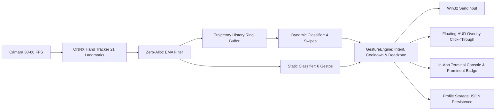

# Walkthrough — Fase 2: MVP Usable — MVPGesture Studio (.NET 10)

Hemos completado íntegramente la **Fase 2 (MVP Usable)** del sistema de control por gestos en tiempo real, transformando el prototipo técnico en una herramienta completamente usable, interactiva y robusta.

---

## 1. Resumen de Capacidades Implementadas en la Fase 2



### Componentes Clave Desarrollados:
1. **Catálogo de 10 Gestos Estables (6 Estáticos + 4 Dinámicos)**:
   - **Estáticos:** `OpenHand`, `Fist`, `Pinch`, `IndexPoint`, `TwoFingersPeace`, `LateralPalm`.
   - **Dinámicos (Swipes):** `SwipeLeft`, `SwipeRight`, `SwipeUp`, `SwipeDown` con ventana deslizante temporal, análisis de velocidad mínima, distancia umbral y rechazo de trayectorias diagonales/ruidosas.
2. **Overlay Flotante Transparente Click-Through (`FloatingOverlayWindow.xaml`)**:
   - Ventana Always-on-Top no invasiva en esquina superior derecha.
   - P/Invoke Win32 con `WS_EX_TRANSPARENT (0x20)` y `WS_EX_LAYERED (0x80000)` mediante `SetWindowLongPtr` de 64 bits. Permite hacer clic a través de ella hacia cualquier ventana del sistema operativo.
   - Retroalimentación visual instantánea: LED de estado del sistema (armado/pausado), perfil activo, icono y nombre del gesto, barra de confianza y animación de pulso al disparar una acción.
3. **Visibilidad en Tiempo Real (Consola & Labels Prominentes)**:
   - **Label Instantáneo Prominente:** En el panel principal con tipografía destacada, iconos representativos y badge de nivel de confianza (`0-100%`).
   - **Consola de Telemetría en Vivo en la App (`LstConsoleLog`):** Estilo terminal oscuro con marcas de tiempo en milisegundos (`[HH:mm:ss.fff]`), botones de *Limpiar* y *Copiar*, opción de *Auto-scroll* y toggle para *Registro detallado fotograma a fotograma*.
   - Salida paralela por `Trace.WriteLine` y `Console.WriteLine` para depuración externa.
4. **Panel de Calibración en Tiempo Real e Integración de Perfiles**:
   - Controles interactivos tipo Slider para:
     - Zona Muerta (`0.005` - `0.050`)
     - Sensibilidad del Ratón (`0.5x` - `4.0x`)
     - Factor de Suavizado EMA Alpha (`0.10` - `0.90`)
     - Tiempo de Sostenimiento Hold (`50 ms` - `400 ms`)
     - **Distancia Mínima de Swipe (`0.05` - `0.35`)**
     - **Velocidad Mínima de Swipe (`0.20 u/s` - `1.50 u/s`)**
   - Botón **"💾 Guardar JSON"** para persistir los valores calibrados en el perfil activo.
   - Botón **"🔄 Recargar"** para recargar perfiles desde disco en caliente.
5. **Persistencia de Perfiles en JSON (`ProfileStorageService`)**:
   - Directorio `./profiles/` con inicialización automática de perfiles base (`global_default.json` y `blender_default.json`).
   - Serialización de los 10 gestos con comandos de teclado/ratón y parámetros de física gestual.

---

## 2. Catálogo Completo de 10 Gestos y Mapeos

| # | Gesto | Tipo | Criterio de Activación | Mapeo por Defecto (Global) | Mapeo (Blender 3D) |
|---|---|---|---|---|---|
| 1 | **`OpenHand`** | Estático | 5 dedos extendidos | Alternar Armado / Pausa | Soltar Clic Medio |
| 2 | **`Fist`** | Estático | 5 dedos plegados | Clic Central (MMB) | Órbita 3D (MMB Down) |
| 3 | **`Pinch`** | Estático | Pulgar e índice en contacto (< 0.05) | Clic Izquierdo (LMB / Drag) | Clic Izquierdo (LMB) |
| 4 | **`IndexPoint`** | Estático | Solo índice extendido | Mover Cursor (con Zona Muerta) | Mover Cursor |
| 5 | **`TwoFingersPeace`** | Estático | Índice y medio en 'V' | Clic Derecho (RMB) | Centrar Vista (NumPad .) |
| 6 | **`LateralPalm`** | Estático | Orientación de palma perpendicular | Modo Neutro | Modo Neutro |
| 7 | **`SwipeLeft`** | Dinámico | Desplazamiento rápido hacia la izquierda ($\Delta X < -0.15$) | Navegar Atrás (`Alt + ←`) | Deshacer (`Ctrl + Z`) |
| 8 | **`SwipeRight`** | Dinámico | Desplazamiento rápido hacia la derecha ($\Delta X > +0.15$) | Navegar Adelante (`Alt + →`) | Rehacer (`Ctrl + Shift + Z`) |
| 9 | **`SwipeUp`** | Dinámico | Desplazamiento rápido hacia arriba ($\Delta Y < -0.15$) | Re Pág (`Page Up`) | Zoom In (`Scroll +120`) |
| 10 | **`SwipeDown`** | Dinámico | Desplazamiento rápido hacia abajo ($\Delta Y > +0.15$) | Av Pág (`Page Down`) | Zoom Out (`Scroll -120`) |

---

## 3. Pruebas Unitarias Automatizadas

Se agregaron tres suites de pruebas unitarias cubriendo los nuevos subsistemas de la Fase 2:
- [`DynamicGestureClassifierTests`](file:///m:/Proyectos/Gonz/MVPGesture/tests/GestureControl.Tests/DynamicGestureClassifierTests.cs): Evaluación de trayectorias sintéticas para `SwipeLeft`, `SwipeRight`, `SwipeUp`, `SwipeDown`, rechazo de movimientos lentos, rechazo de distancias insuficientes y rechazo de vectores diagonales.
- [`TrajectoryHistoryBufferTests`](file:///m:/Proyectos/Gonz/MVPGesture/tests/GestureControl.Tests/TrajectoryHistoryBufferTests.cs): Comprobación del búfer circular sin asignaciones de memoria, rotación de índice y cálculo de métricas de ventana temporal.
- [`ProfileJsonPersistenceTests`](file:///m:/Proyectos/Gonz/MVPGesture/tests/GestureControl.Tests/ProfileJsonPersistenceTests.cs): Almacenamiento, deserialización y comprobación de integridad para los 10 gestos y parámetros de configuración.

### Resultado de Ejecución de Pruebas:
```text
Serie de pruebas para M:\Proyectos\Gonz\MVPGesture\tests\GestureControl.Tests\bin\Debug\net10.0-windows\GestureControl.Tests.dll (.NETCoreApp,Version=v10.0)
1 archivos de prueba en total coincidieron con el patrón especificado.

Correctas! - Con error: 0, Superado: 38, Omitido: 0, Total: 38, Duración: 1 s - GestureControl.Tests.dll (net10.0)
```

### Compilación Completa de la Solución:
```text
dotnet build MVPGesture.slnx

Compilación correcta.
    0 Advertencia(s)
    0 Errores

Tiempo transcurrido 00:00:22.35
```

---

## 4. Estado de Archivos Modificados y Creados

```
src/
  ├── GestureControl.Core/
  │    ├── Models/
  │    │    ├── HandGestureType.cs                (Extendido con IsDynamic/IsStatic)
  │    │    ├── HandTrajectoryPoint.cs            [NUEVO] (Estructura de trayectoria)
  │    │    ├── ActionCommand.cs                  (NoneWithDescription)
  │    │    └── AppProfile.cs                     (10 gestos y parámetros de swipe)
  │    ├── Interfaces/
  │    │    ├── IDynamicGestureClassifier.cs      [NUEVO]
  │    │    ├── IGestureEngine.cs                 (Overrides de swipe)
  │    │    └── IActionDispatcher.cs              (Métodos de perfiles)
  │    └── Pipeline/
  │         └── GesturePipelineOrchestrator.cs    (Confidence y telemetría por frame)
  ├── GestureControl.Gestures/
  │    ├── Classifiers/
  │    │    ├── TrajectoryHistoryBuffer.cs        [NUEVO] (Búfer circular zero-alloc)
  │    │    └── DynamicGestureClassifier.cs       [NUEVO] (Clasificador de 4 swipes)
  │    └── Engine/
  │         └── GestureEngine.cs                  (Integración dinámica + estática)
  ├── GestureControl.Interop/
  │    └── Native/
  │         └── Win32Input.cs                     (MakeWindowClickThrough P/Invoke)
  ├── GestureControl.Infrastructure/
  │    └── Persistence/
  │         └── ProfileStorageService.cs          (EnsureDefaultProfilesAsync)
  ├── GestureControl.Actions/
  │    └── Profiles/
  │         └── ProfileManager.cs                 (UpsertProfile y LoadProfiles)
  └── GestureControl.App/
       ├── FloatingOverlayWindow.xaml(.cs)        [NUEVO] (HUD click-through transparente)
       ├── MainWindow.xaml                        (Layout renovado, consola, 10 gestos)
       └── MainWindow.xaml.cs                     (Calibración, log en vivo y HUD sync)
tests/
  └── GestureControl.Tests/
       ├── DynamicGestureClassifierTests.cs       [NUEVO]
       ├── TrajectoryHistoryBufferTests.cs        [NUEVO]
       └── ProfileJsonPersistenceTests.cs         [NUEVO]
```
